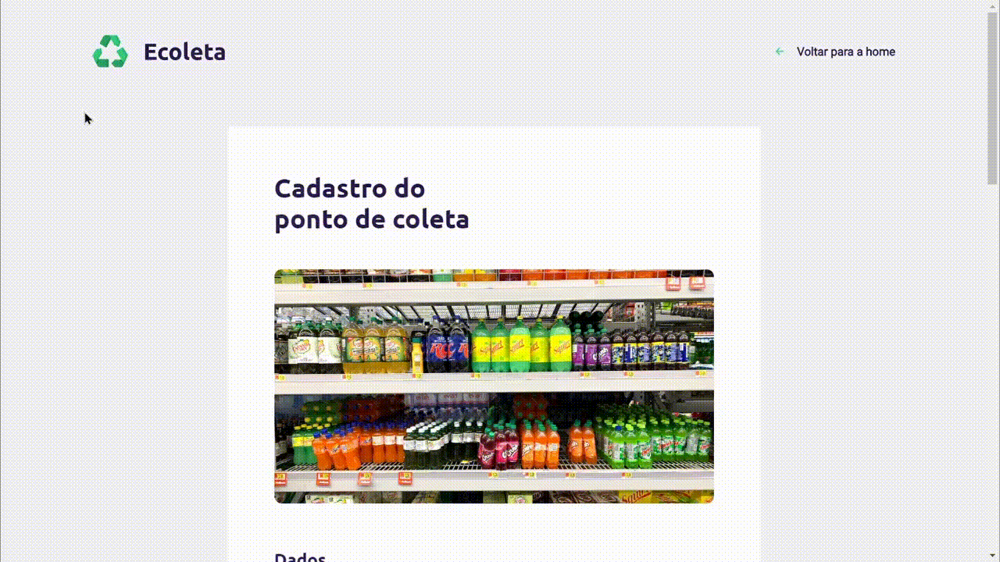

<p align="center">
  <a href="https://github.com/cristianprochnow/Ecoleta">
    
  </a>

  <p align="center">
    The fastest and practical way to help the natural environment around you.
    <br />
    <a href="https://github.com/cristianprochnow/Ecoleta"><strong>Explore the docs »</strong></a>
    <br />
    <br />
    <a href="https://github.com/cristianprochnow/Ecoleta/issues">Report Bug</a>
    ·
    <a href="https://github.com/cristianprochnow/Ecoleta/issues">Request Feature</a>
  </p>
</p>
<div align="center">

  [![Contributors][contributors-shield]][contributors-url]
  [![Forks][forks-shield]][forks-url]
  [![Stargazers][stars-shield]][stars-url]
  [![Issues][issues-shield]][issues-url]
  [![Repo Size][repo-size-shield]][repo-size-url]
  [![Code Size][code-size-shield]][code-size-url]
  [![MIT License][license-shield]][license-url]

</div>
<br />

<h1>Table of Contents</h1>

* [About the Project](#about-the-project)
* [Built With](#built-with)
* [Features](#features)
* [Getting Started](#getting-started)
  * [Prerequisites](#prerequisites)
  * [Installation](#installation)
* [Usage](#usage)
  * [Web](#web-usage)
  * [Mobile](#mobile-usage)
* [Contributing](#contributing)
* [License](#license)
* [Contact](#contact)

<br />

<h1 id="about-the-project">About The Project</h1>

<br />

<div align="center">

  [![Product Name Screen Shot][product-screenshot]](./.github/ecoleta.png)

</div>

<br />

**The fastest way to find the recyclable waste collection point near your home or localization.** With a simple click in your smartphone device, you will be able to help the natural environment around you. This simple (and awesome) attitude can transform and change since your self habits, until all the world.

<h1 id="built-with">Built With</h1>

* [Node](https://github.com/nodejs/node)
* [React](https://github.com/facebook/react)
* [React Native](https://github.com/facebook/react-native)
* [Expo](https://github.com/expo/expo)


<h1 id="features">Features</h1>

- [x] Sign up a point collector of recyclabe trash.
- [x] Find a point around your home.
- [x] Filter the content of the map by localization or trash type.
- [x] Responsive interface.

And more coming soon...


<h1 id="getting-started">Getting Started</h1>

<h2 id="prerequisites">Prerequisites</h2>

- [Node](https://nodejs.org/en/download/)
- [React Native environment](https://reactnative.dev/docs/environment-setup)
- [Expo](https://docs.expo.io/)

<h2 id="installation">Installation</h2>

1. Install all the packages
```shell
# Node
npm install

# Yarn
yarn
```

2. Start the database
```shell
# Node
npm run knex:migrate

# Yarn
yarn knex:migrate
```

3. Add data seed to database
```shell
# Node
npm run knex:seed

# Yarn
yarn knex:seed
```

4. Start the server (inside `server` folder)
```shell
# Node
npm run dev

# Yarn
yarn dev
```

5. Start the web interface (inside `web` folder)
```shell
# Node
npm start

# Yarn
yarn start
```

6. Start the Expo app (inside `mobile` folder)
```shell
# Node
npm start

# Yarn
yarn start
```


<h1 id="usage">Usage</h1>

<h2 id="web-usage">Web</h2>

Only run the previous command and it's done (you will be redirected to browser page automatically).

_If this don't work, go to browser and access `http://localhost:3000`_



<h2 id="mobile-usage">Mobile</h2>

1. Install the Expo in your [IOS](https://apps.apple.com/br/app/expo-client/id982107779) or [Android](https://play.google.com/store/apps/details?id=host.exp.exponent&hl=en) device.
2. Enter in your Expo app, and then, select the `Scan QR Code` functionality.
3. Point the scanner frame to QR code from the browser's page opened (the expo page that you've been redirected when run `start` command in `mobile` folder)
4. It's done! After this process the application starts to load and then will be able to work in your smartphone.


<br />

<h1 id="contributing">Contributing</h1>

Contributions are what make the open source community such an amazing place to be learn, inspire, and create. Any contributions you make are **greatly appreciated**.

1. 🍴 Fork the Project
2. 👯 Clone this project (`git clone https://github.com/cristianprochnow/Ecoleta.git`)
3. 🔀 Create your Feature Branch (`git checkout -b my-feature`)
4. ✔️ Commit your Changes (`git commit -m 'feat: my new feature'`)
5. 📌 Push to the Branch (`git push origin my-feature`)
6. 🔁 Open a Pull Request


<h1 id="license">License</h1>

Distributed under the MIT License. See `LICENSE` for more information.


<h1 id="contact">Contact</h1>

Your Name - [![Linkedin][linkedin-shield]][linkedin-url]

Project Link: [https://github.com/your_username/repo_name](https://github.com/your_username/repo_name)

<br />
<br />

_Made with &hearts; in Next Level Week. Enjoy it!_

[contributors-shield]: https://img.shields.io/github/contributors/cristianprochnow/Ecoleta.svg?style=flat
[contributors-url]: https://github.com/cristianprochnow/Ecoleta/graphs/contributors
[forks-shield]: https://img.shields.io/github/forks/cristianprochnow/Ecoleta.svg?style=flat
[forks-url]: https://github.com/cristianprochnow/Ecoleta/network/members
[stars-shield]: https://img.shields.io/github/stars/cristianprochnow/Ecoleta.svg?style=flat
[stars-url]: https://github.com/cristianprochnow/Ecoleta/stargazers
[issues-shield]: https://img.shields.io/github/issues/cristianprochnow/Ecoleta.svg?style=flat
[issues-url]: https://github.com/cristianprochnow/Ecoleta/issues
[license-shield]: https://img.shields.io/github/license/cristianprochnow/Ecoleta.svg?style=flat
[license-url]: https://github.com/cristianprochnow/Ecoleta/blob/master/LICENSE.txt
[repo-size-shield]: https://img.shields.io/github/repo-size/cristianprochnow/Ecoleta.svg?style=flat
[repo-size-url]: https://github.com/cristianprochnow/Ecoleta
[code-size-shield]: https://img.shields.io/github/languages/code-size/cristianprochnow/Ecoleta
[code-size-url]: https://github.com/cristianprochnow/Ecoleta
[linkedin-shield]: https://img.shields.io/badge/-LinkedIn-black.svg?style=flat&logo=linkedin&colorB=0077b4
[linkedin-url]: https://www.linkedin.com/in/cristianprochnow
[product-screenshot]: ./.github/ecoleta.png
